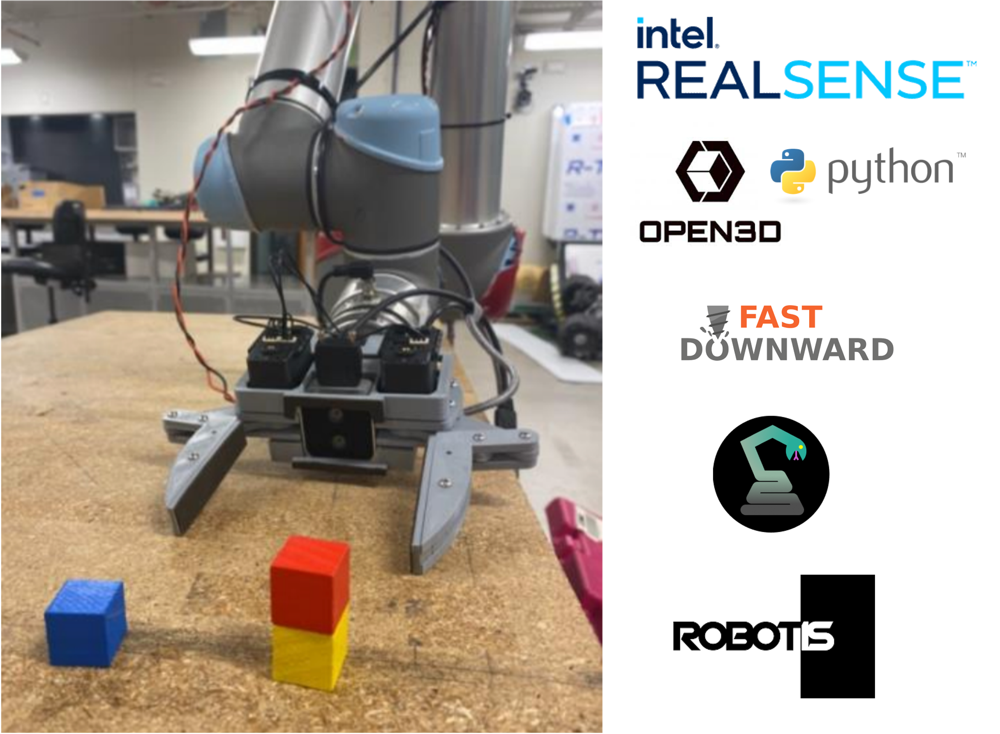

# MAGPIE $^2$
#### **M**anipulation **A**rchitecture for **G**oal **P**lanning, **I**nference, and **E**xecution

More info: [https://arxiv.org/pdf/2402.06018](https://arxiv.org/pdf/2402.06018)

# Installation
## Required
1. `git clone --recurse-submodules git@github.com:correlllab/MAGPIE.git`
1. `cd MAGPIE`
1. `python3.9 -m pip install -r requirements.txt --user`
1. `sudo cp openCM.rules /etc/udev/rules.d/`
1. `sudo adduser $USER dialout`
## First install ONLY
1. `sudo add-apt-repository ppa:sdurobotics/ur-rtde` 
1. `sudo apt-get update`
1. `sudo apt install librtde librtde-dev`
## Required
1. `python3.9 -m pip install ur_rtde --user`
1. `git checkout PDDLStream_Testing`
1. `git submodule update --init --recursive`
1. `./pddlstream/downward/build.py`
1. Logout or Restart

# Dependencies
* Python 3.9

    
