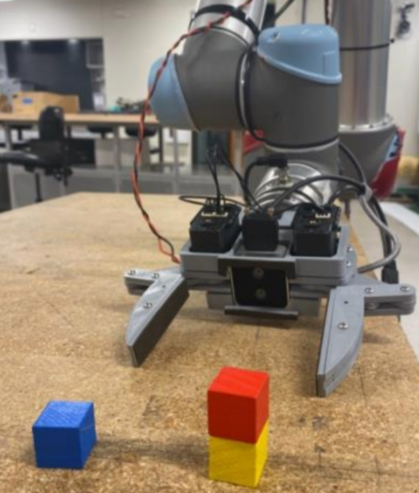
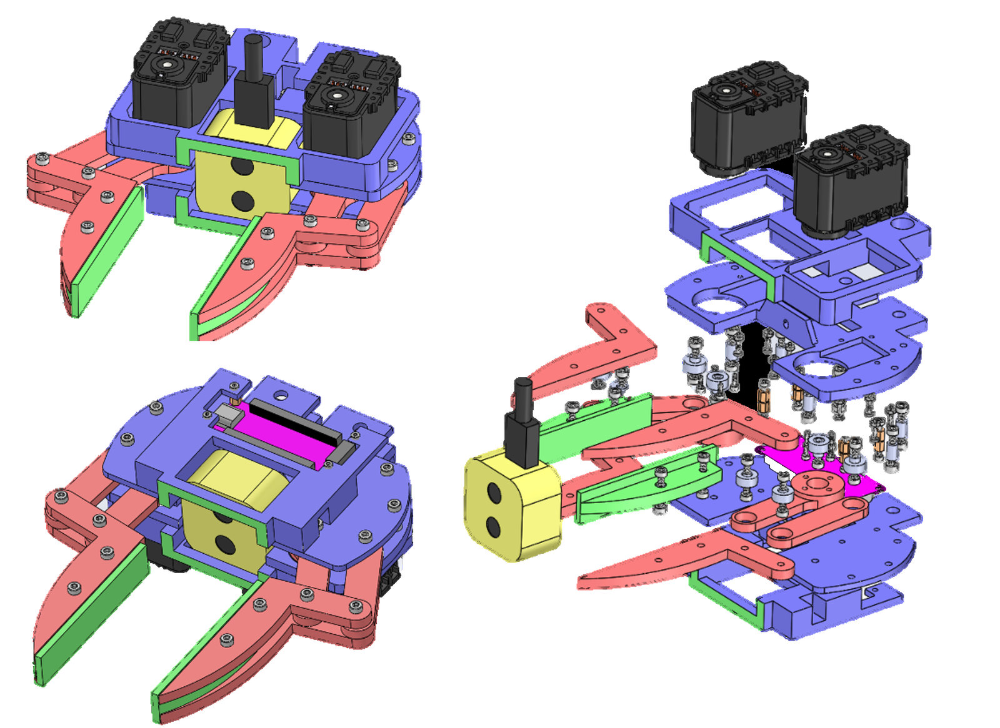
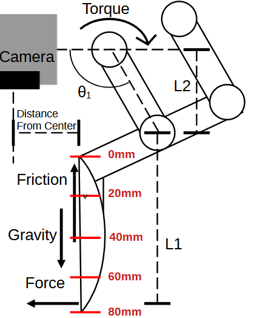
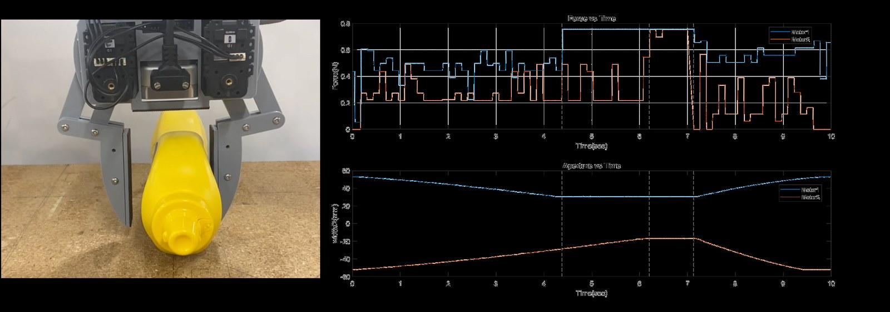
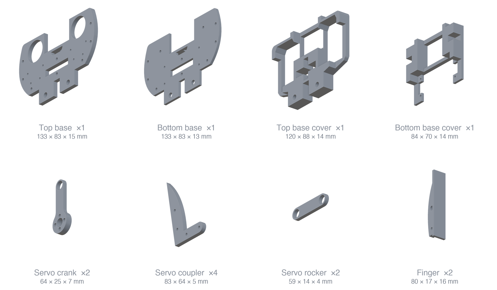
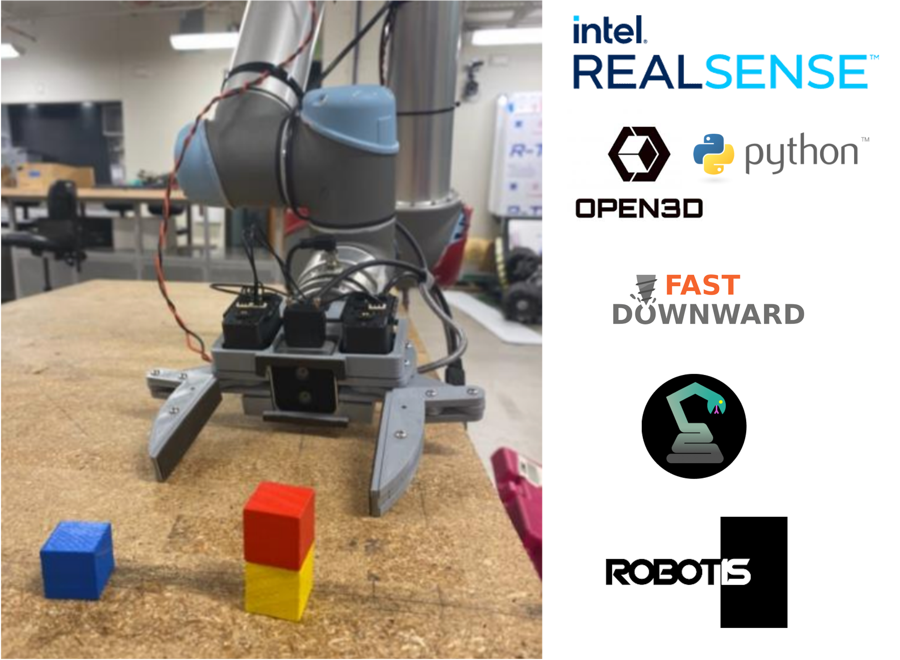
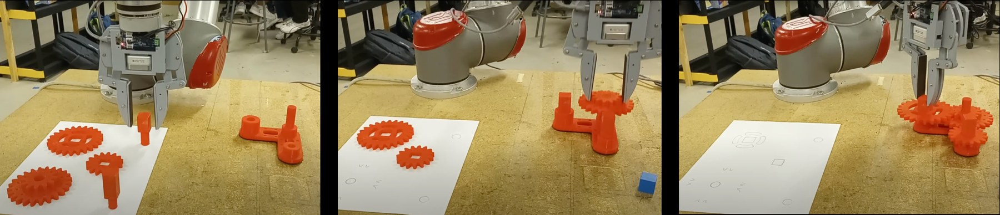
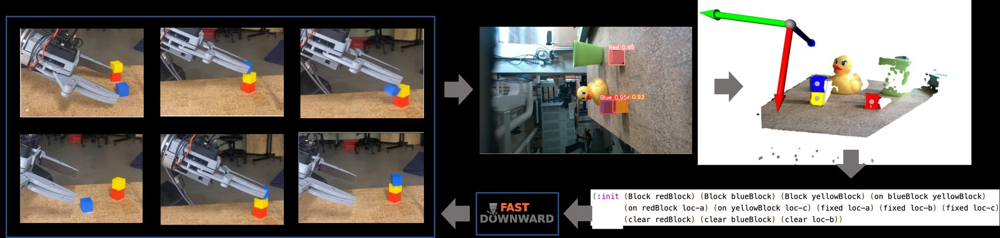

<div align="center">



# MAGPIE

**M**anipulation **A**rchitecture for **G**rasping and **P**erception in **I**ntelligent **E**xperiments

A 3D-printed, force-controlled robot hand with a depth camera in its palm —
and the Python stack that sees, plans and grasps with it.

[](https://arxiv.org/abs/2402.06018)
[](LICENSE)
[](pyproject.toml)
[](docs/build.md)

</div>

---

Two fingers, each on its own four-bar linkage driven by its own smart servo, and an
Intel RealSense D405 looking out from between them. Because the motors are
torque-controlled, the hand is soft enough for a strawberry and firm enough to
seat a gear on a peg — and because the camera is in the palm rather than on the
wrist, it keeps seeing the object right up until the fingers touch it.

Everything needed to reproduce it is in this repository under the MIT licence:
the CAD, the STLs, the bill of materials, the servo driver, the perception
pipeline, and the behaviour-tree/PDDL layer that turns a goal into a sequence of
moves.

|  |  |
| --- | --- |
| **Aperture** | 106.24 mm, fingers driven independently |
| **Grip force** | up to 32 N, commanded in 0.08 N steps |
| **Sensing** | RealSense D405 in the palm — 1280×720, 87°×58°, 7–50 cm |
| **Actuation** | 2 × Dynamixel AX-12A (1.5 Nm stall), OpenRB-150 controller |
| **Mass** | 414 g |
| **Parts cost** | ≈ $460, camera included |
| **Printed parts** | 8 unique, 13 pieces, ≈ 181 cm³ of PLA |
| **Largest part** | 133 × 83 mm — fits any 150 mm bed |

> **New here?** [**docs/build.md**](docs/build.md) walks from an empty print bed
> to a hand that opens and closes; [**docs/bom.md**](docs/bom.md) is what to buy.

## How the hand works

<div align="center">

</div>

Each finger is a **four-bar linkage**: the servo turns a crank, the crank drives a
coupler, and the coupler carries the finger through an arc that keeps the
gripping face roughly parallel to its partner. The linkage buys two things — a
wide 106 mm opening from a servo that only sweeps ~90°, and an unobstructed cone
of view for the palm camera, which a parallel-jaw slide would have blocked.

<table>
<tr>
<td width="58%">

**Force control comes from the servos, not from a sensor.** The AX-12A reports and
limits its own current, so the same register that closes the fingers also sets
how hard they may squeeze. `Gripper.set_force()` converts newtons at the
fingertip into that register through a curve measured on a force gauge: linear
from 0 to 9 N (*R²* = 0.995), then quadratic to 32 N (*R²* = 0.999). In the linear
regime the smallest step the hand can take is **0.08 N**.

Reading the same register backwards gives touch. `close_until_contact_force()`
walks the fingers in one-tick increments and stops each one the moment its own
load crosses a threshold, so an object placed off-centre is not shoved across the
table while the far finger catches up — the near finger simply waits.

</td>
<td width="42%">

</td>
</tr>
</table>

<div align="center">


<sub>Closing on the YCB mustard bottle, placed off-centre. The right finger touches
first and holds; the bottle does not move.</sub>
</div>

## The printed set

<div align="center">

</div>

Eight unique parts, thirteen pieces, all printable in PLA on a 150 mm bed. The
renders above are generated from the STLs in [`hand/stls/`](hand/stls) by
[`tools/render_stl.py`](tools/render_stl.py), so they stay honest if a part is
revised. SolidWorks sources are in [`hand/CAD/`](hand/CAD).

→ [**Build guide**](docs/build.md) · [**Bill of materials**](docs/bom.md)

## Software

<div align="center">

</div>

The stack deliberately avoids ROS: it is a plain Python package, so a student can
read the whole path from a camera frame to a servo command in an afternoon.

```bash
git clone https://github.com/correlllab/MAGPIE.git
cd MAGPIE
python3.10 -m pip install .
```

Python 3.10+. On Ubuntu the original install notes also remove the distribution's
matplotlib, which conflicts with the pip-installed stack:
`sudo dpkg -r --force-depends python3-matplotlib`. On Linux, give yourself access
to the servo board with [`openCM.rules`](openCM.rules) — see
[the build guide](docs/build.md#5-connect-it-to-a-computer).

### Driving the hand

```python
from magpie.gripper import Gripper

hand = Gripper(servoport="/dev/ttyACM0")   # 'COM3' on Windows
hand.reset_parameters()                    # default speed, torque, compliance; opens the hand

hand.set_force(2.0)                        # newtons at the fingertip, per finger
hand.set_goal_aperture(60.0)               # millimetres between the fingers

# close until each finger feels 1.5 N, and no further than 20 mm apart
hand.close_until_contact_force(stop_aperture=20.0, stop_force=1.5)

print(hand.get_aperture(), "mm", hand.get_force(), "N")
hand.disconnect()
```

`deligrasp()` goes one step further: it grasps, watches the load for slip,
tightens by a fixed increment and repeats — returning the aperture, the force it
settled on, and the stiffness it measured on the way.

### Seeing, and moving

```python
from magpie.realsense_wrapper import RealSense
from magpie.ur5 import UR5_Interface

cam = RealSense(zMax=0.5)      # metres; also voxel-downsamples the cloud
cam.initConnection()
pcd = cam.getPCD()             # Open3D point cloud in the camera frame

arm = UR5_Interface(robotIP="192.168.0.4")
arm.start()
pose = arm.get_tcp_pose()      # 4×4 homogeneous
pose[2, 3] += 0.05             # up 5 cm
arm.moveL(pose)
```

[`test/robot_cam_test.py`](test/robot_cam_test.py) is exactly this, and is the
quickest way to prove that arm and camera are both talking to you.

### The modules

| Module | What it does |
| --- | --- |
| [`magpie.gripper`](src/magpie/gripper.py) | The hand: aperture, force, contact detection, slip-aware grasping |
| [`magpie.ax12`](src/magpie/ax12.py) | Dynamixel AX-12A register-level driver |
| [`magpie.motor_code`](src/magpie/motor_code.py) | Bare two-servo control, useful while commissioning |
| [`magpie.realsense_wrapper`](src/magpie/realsense_wrapper.py) | D405 frames, intrinsics and Open3D point clouds |
| [`magpie.ur5`](src/magpie/ur5.py) | UR5/UR10 over RTDE — joint and linear moves, TCP and camera frames |
| [`magpie.grasp`](src/magpie/grasp.py) | Grasp poses from a segmented object, and the approach/retreat moves |
| [`magpie.BT`](src/magpie/BT.py) | Behaviour-tree nodes (`Pick_at_Pose`, `Jog_Safe`, …) built on `py_trees` |
| [`magpie.poses`](src/magpie/poses.py), [`magpie.homog_utils`](src/magpie/homog_utils.py) | Frames, transforms and the arithmetic between them |

The pipeline the paper describes runs on top of these: YOLOv5 segments the RGB
image, the masks cut objects out of the point cloud, PCA on each object gives a
grasp pose, and the resulting scene is written out as a PDDL 2.1 problem that
FastDownward solves. The plan becomes a behaviour tree, and it is re-solved after
every step — which is what lets the robot recover when the world moves.

## What it does with all that

<div align="center">


<sub><b>Sub-millimetre assembly.</b> The Siemens gear assembly problem, open loop from a
kitting mat: 8 of 10 attempts complete.</sub>

<br><br>



<sub><b>Recovering from its own mistakes.</b> The robot knocks the tower over while placing
the blue block, re-reads the scene, re-plans, and finishes the job. Over 50 runs of a
single step, 42 succeeded — 30 of them first try.</sub>
</div>

## Repository layout

```
hand/
  CAD/                SolidWorks parts
  stls/               what you print — 4-bar/ (linkage) and structure/ (palm)
src/magpie/           the Python package
test/                 a smoke test for arm + camera
tools/                regenerate the figures in these docs
docs/
  build.md            print, assemble, wire, calibrate
  bom.md              bill of materials, with links and prices
  img/                renders and paper figures
  paper/              the paper, as published
openCM.rules          udev rule for the servo board
```

Other branches carry the research built on top of this one (`ISRR_2024`,
`open-grasp`, `encore`); `main` is the hand and the base stack.

## License and credits

MIT — see [LICENSE](LICENSE). Built in the
[Correll Lab](https://www.colorado.edu/lab/correll/) at the University of
Colorado Boulder by Nikolaus Correll, Dylan Kriegman, Stephen Otto and James
Watson. The force model comes from Stephen Otto's thesis; the planning layer
stands on [FastDownward](https://www.fast-downward.org/),
[py2PDDL](https://github.com/remykarem/py2pddl) and
[py_trees](https://github.com/splintered-reality/py_trees), and the perception on
[YOLOv5](https://github.com/ultralytics/yolov5) and
[Open3D](https://www.open3d.org/).

Supported by the National Science Foundation, "USDA-NIFA NRI INT: Autonomous
Restoration and Revegetation of Degraded Ecosystems".

## Citation

The hand, the force characterisation and the manipulation pipeline are described
in — and this repository is the artifact of —
[**A versatile robotic hand with 3D perception, force sensing for autonomous
manipulation**](https://arxiv.org/abs/2402.06018) (RSS 2024 Workshop on
Perception and Manipulation Challenges for Warehouse Automation, Daejeon, Korea).
A copy is kept in this repository at
[`docs/paper/2402.06018-magpie.pdf`](docs/paper/2402.06018-magpie.pdf), recompressed
to keep a clone small — [arXiv](https://arxiv.org/abs/2402.06018) has the original.

```bibtex
@inproceedings{correll2024versatile,
  title     = {A versatile robotic hand with {3D} perception, force sensing for
               autonomous manipulation},
  author    = {Correll, Nikolaus and Kriegman, Dylan and Otto, Stephen and
               Watson, James},
  booktitle = {RSS Workshop on Perception and Manipulation Challenges for
               Warehouse Automation},
  address   = {Daejeon, Korea},
  year      = {2024},
  eprint    = {2402.06018},
  archivePrefix = {arXiv},
  primaryClass  = {cs.RO},
  url       = {https://arxiv.org/abs/2402.06018}
}
```
