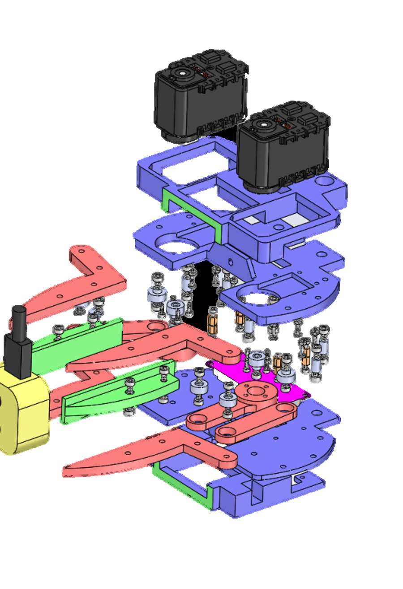
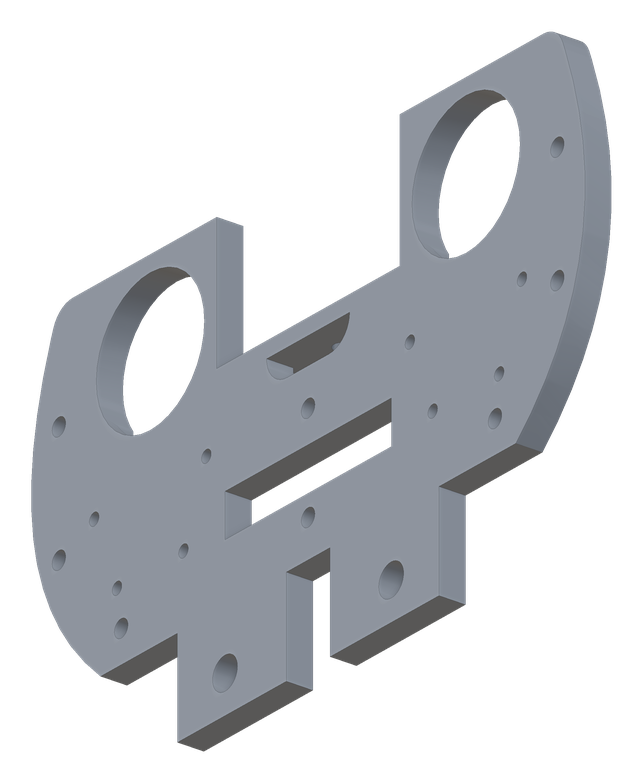
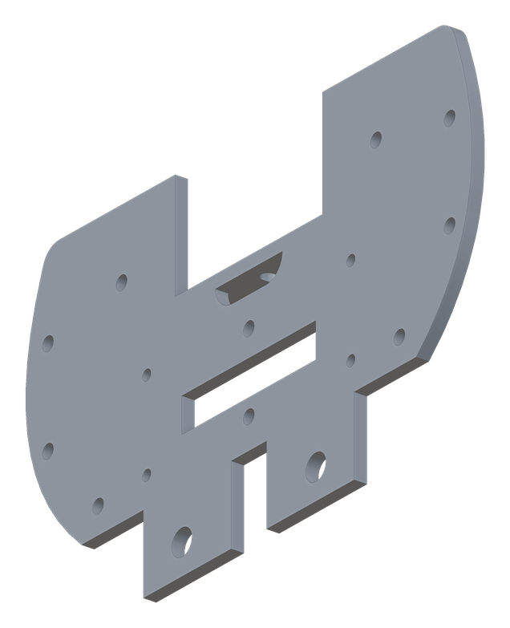
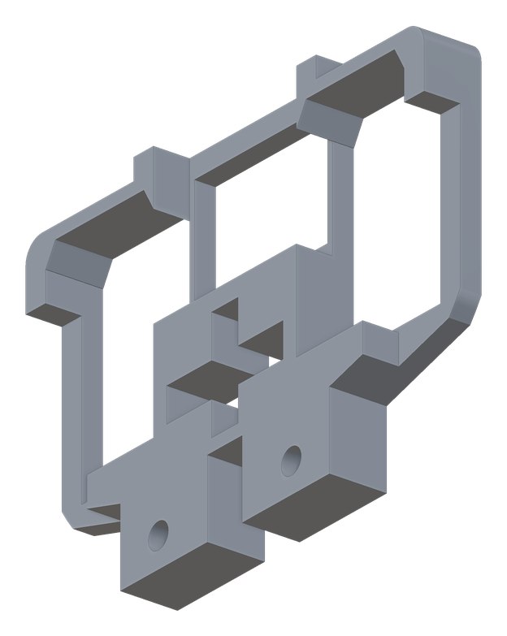
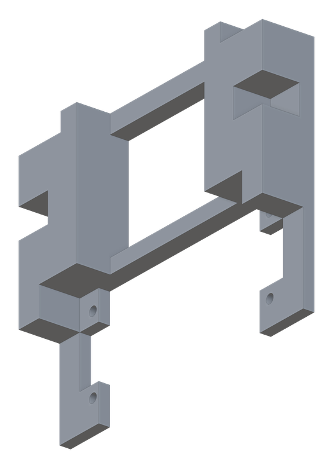
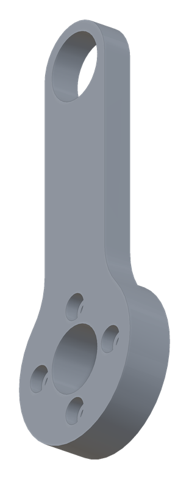
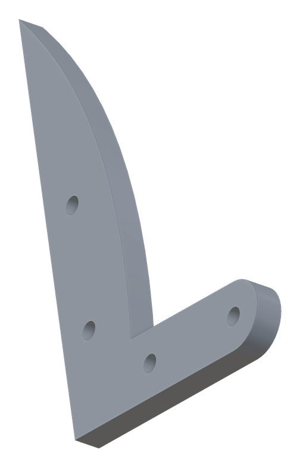
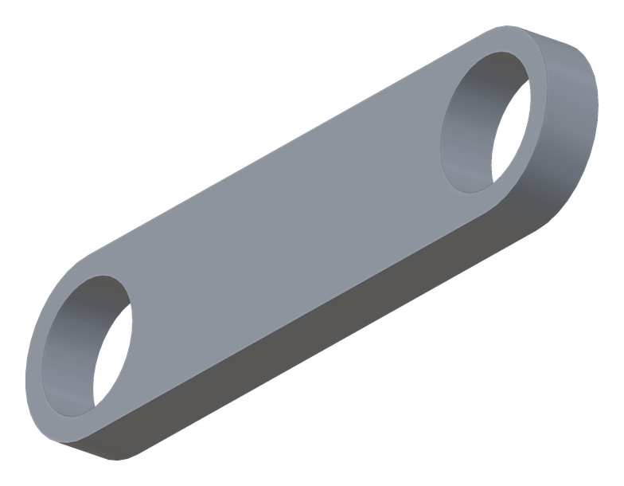
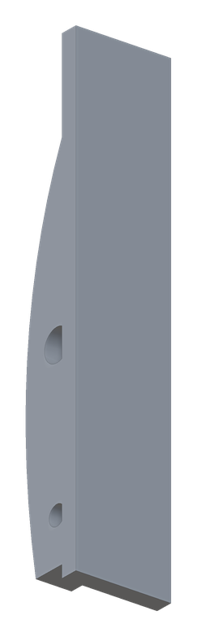

# Building the MAGPIE hand

From an empty print bed to a hand that opens, closes and knows how hard it is
squeezing. Budget an evening for printing and an afternoon for the rest.

<div align="center">

</div>

> [!TIP]
> **Building one today?** This guide is for the hand as published. The revised
> hardware — [correlllab/magpie_assembly](https://github.com/correlllab/magpie_assembly) —
> has fewer parts and
> [a guide with a photograph of every step](https://github.com/correlllab/magpie_assembly/blob/main/Documentation/assembly.md).

> **On the provenance of this guide.** The repository ships CAD, STLs and a parts
> list, but never shipped a written procedure. What follows is reconstructed from
> the exploded view above, the bill of materials in the paper, and the driver code
> in [`src/magpie/`](../src/magpie). The mechanics are as the CAD has them; where a
> step names a specific fastener it is inferred from the parts list, so check it
> against the CAD before you commit. Corrections are welcome as issues.

---

## 1. Print the parts

Eight unique parts, thirteen pieces, ≈ 181 cm³ of plastic — about 220 g if you
printed them solid, roughly half that at a normal infill. The largest is
133 × 83 mm, so any 150 mm bed will do.

| | Part | Qty | Size | STL |
| --- | --- | --- | --- | --- |
|  | **Top base** | 1 | 133 × 83 × 15 mm | [`structure/base_top.STL`](../hand/stls/structure/base_top.STL) |
|  | **Bottom base** | 1 | 133 × 83 × 13 mm | [`structure/base_bottom.STL`](../hand/stls/structure/base_bottom.STL) |
|  | **Top base cover** | 1 | 120 × 88 × 14 mm | [`structure/cover_top.STL`](../hand/stls/structure/cover_top.STL) |
|  | **Bottom base cover** | 1 | 84 × 70 × 14 mm | [`structure/cover_bottom.STL`](../hand/stls/structure/cover_bottom.STL) |
|  | **Servo crank** | 2 | 64 × 25 × 7 mm | [`4-bar/crank.STL`](../hand/stls/4-bar/crank.STL) |
|  | **Servo coupler** | 4 | 83 × 64 × 5 mm | [`4-bar/coupler.STL`](../hand/stls/4-bar/coupler.STL) |
|  | **Servo rocker** | 2 | 59 × 14 × 4 mm | [`4-bar/rocker.STL`](../hand/stls/4-bar/rocker.STL) |
|  | **Finger** | 2 | 80 × 17 × 16 mm | [`4-bar/finger.STL`](../hand/stls/4-bar/finger.STL) |

**Material.** The paper's hand is PLA throughout. PLA is stiff enough for the
linkage and forgiving of a press fit; the trade-off, spelled out in the paper, is
that it will never match sheet metal for accuracy on very small parts.

**Orientation.** Every part has an orientation in which it needs essentially no
support: lay each one on a flat face with its pockets and counterbores upward.
The finger is the fussy one, because its gripping face is curved — try both of
its flat sides in the slicer and take whichever asks for no support.

**Fit.** The bearings are a **press fit** into the links, and the linkage's
accuracy depends on it: a loose seat gives you play in the fingertip, a tight one
splits the part. Print one coupler first and try a bearing in it before you commit
to the whole set.

## 2. Buy the rest

The full list, with links and prices, is in [**bom.md**](bom.md) — ≈ $460, of
which the camera is $272. In short: two AX-12A servos, an OpenRB-150 controller,
an Intel RealSense D405, eight 5 × 10 × 4 mm bearings, and a fistful of M2/M2.5/M3
hardware.

**Tools.** A 3D printer, hex/Phillips drivers for M2–M3, a small vice or clamp for
pressing bearings, and a 12 V 3 A supply.

## 3. Set the servos up before they go in

Do this while the servos are still loose on the bench — one of the steps moves
them to a hard limit.

1. Connect the OpenRB-150 to your computer and the servos to the board, and open
   [Dynamixel Wizard 2.0](https://emanual.robotis.com/docs/en/software/dynamixel/dynamixel_wizard2/).
2. Give one servo **ID 1** and the other **ID 2**, and set both to **1 Mbps**
   (1,000,000 baud) — that is what [`magpie.ax12`](../src/magpie/ax12.py) opens the
   port at.
3. **ID 1 is the right-hand finger when the camera is facing you**
   ([`gripper.py`](../src/magpie/gripper.py) says so, and the calibration constants
   assume it).
4. Drive both servos to the ends of their travel, so the cranks can be fitted at a
   known angle:

   ```python
   from magpie.gripper import Gripper
   Gripper().setup()      # finger 1 -> 0, finger 2 -> 1023. Motors must be off the hand.
   ```

## 4. Assemble

The hand is a sandwich. The two base plates carry the servos and hold the camera
between them; the four-bar linkages run on the outer faces; the two covers close
the servo bay and the camera bay.

1. **Press the bearings** into their seats in the couplers, rockers and fingers —
   eight in all, four per finger, one per joint of each four-bar. Press them square,
   in a vice, not with a hammer.
2. **Build each linkage flat on the bench**: crank, coupler, rocker, finger. Each
   joint is a bearing with a round M3 standoff through it as the axle and an M3
   screw from either side; the standoffs (8 × M3 × 8 mm) match the eight bearings.
   The joints should fall under their own weight when you lift the linkage.
3. **Mount the servos** to the base plates. The AX-12A takes M2 hardware, and the
   list has eight M2 bolts — four per servo.
4. **Fit the cranks** to the servo horns without changing the horn angle you set in
   step 3. Get this wrong and the fingers will hit their limits before they meet.
5. **Close the sandwich**: bottom base, linkages, top base — held apart by the
   M3 × 6 standoffs and pulled together with M3 screws.
6. **Fit the camera** in the palm bay between the plates, on the M2.5 × 10 mm
   standoffs, lens looking out between the fingers.
7. **Put the covers on** — the top cover closes the servo bay, the bottom one the
   camera bay. Route the servo and camera cables out before you close it.

Compare against the top and bottom views in
[`img/cad-views.png`](img/cad-views.png) as you go.

## 5. Connect it to a computer

Three cables leave the hand, and on a robot arm all three have to be routed along
it:

| Cable | Goes to | Note |
| --- | --- | --- |
| USB 3.1 | the D405 | USB 3 — the camera will not stream depth over USB 2 |
| USB 2.0 | the OpenRB-150 | shows up as `/dev/ttyACM0` on Linux, `COM*` on Windows |
| 12 V, ≥ 3 A | the servo board | 36 W; the servos stall at 1.5 Nm and will ask for it |

On Linux, give yourself the serial port. The repository ships a udev rule:

```bash
sudo cp openCM.rules /etc/udev/rules.d/99-opencm.rules
sudo udevadm control --reload-rules && sudo udevadm trigger
sudo usermod -aG dialout "$USER"      # log out and back in
```

If the port still comes up root-owned, check the rule's vendor ID against what
your board actually reports (`lsusb`) — the shipped rule was written for one
particular board.

## 6. Calibrate the fingers

The mapping from millimetres of aperture to servo ticks is geometric, but it is
anchored on three measured angles per finger, and those are specific to *your*
build. They live at the top of
[`Gripper.__init__`](../src/magpie/gripper.py), in degrees of the AX-12A's 300°
range:

```python
self.Finger1theta_max = 176   # closed
self.Finger1theta_min = 85    # open
self.Finger2theta_max = 218
self.Finger2theta_min = 128
self.Finger1theta_90  = 150   # crank bar parallel to the camera
self.Finger2theta_90  = 155
```

With the hand assembled and the torque off, move each finger by hand to its open
and closed limits and read the position back in Dynamixel Wizard; then set each
finger so its crank bar is parallel to the camera face and read that too. Convert
ticks to degrees with `θ = position × 300 / 1023` and write the six numbers in.
Anything that rubs or binds at the limits should be fixed here rather than
trimmed away in software.

The link geometry underneath — crank 45 mm, finger 80 mm, and the offsets between
the camera, the servo axis and the finger base — is fixed by the CAD and marked
*don't touch* in the code. Only change it if you have changed a part.

## 7. First grasp

```python
from magpie.gripper import Gripper

hand = Gripper(servoport="/dev/ttyACM0")
hand.reset_parameters()                 # opens the hand, restores defaults
hand.set_force(2.0)                     # newtons per finger
hand.close_until_contact_force(stop_aperture=20.0, stop_force=1.5)
print(hand.get_aperture(), "mm", hand.get_force(), "N")
hand.open_gripper()
hand.disconnect()
```

Put something soft in the way first. If the fingers close on nothing and stop at
20 mm, the aperture calibration is good; if they arrive there having reported
force the whole way, revisit step 6.

## When it does not work

| Symptom | Where to look |
| --- | --- |
| `Ax12.connect()` fails, or no `/dev/ttyACM0` | Cable, then udev and `dialout` (step 5). On Windows pass `servoport="COM3"`. |
| Servos stop answering after a hard squeeze | The AX-12A has latched an overload — `hand.reset_packet_overload()` re-enables torque and restores the limit. Find out what jammed. |
| One finger runs the wrong way | The two servo IDs are swapped. ID 1 is the right finger with the camera facing you. |
| Fingers reach their limit before touching | The crank was fitted at the wrong horn angle (steps 3–4), or `theta_min`/`theta_max` are someone else's (step 6). |
| Reported force wanders near zero | Below ≈ 0.25 N the load-to-newton curve is an approximation, and the code says so. Contact detection is reliable above that. |
| No depth from the camera | USB 3 port and USB 3 cable. `RealSense.initConnection()` will tell you what it found. |
| Point cloud is empty beyond arm's length | `RealSense(zMax=…)` clips in metres, and the D405 only sees from 7 to 50 cm. |

## Where the numbers come from

The force curve, the 106.24 mm aperture, the mass and the cost are all measured
and reported in the paper, kept in this repository at
[`paper/2402.06018-magpie.pdf`](paper/2402.06018-magpie.pdf) —
[arXiv:2402.06018](https://arxiv.org/abs/2402.06018).
