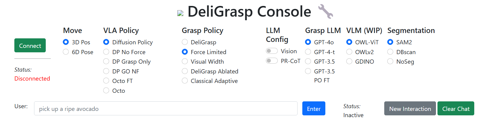
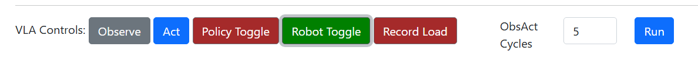

# Diffusion policies overview

I've trained 4 diffusion policy models on the 130 trajectories with force feedback. I train each for only 30 epochs (about 3000 steps), super short but the loss curves look flat. 

The breakdown:
1. DG: Observes: 
{6D pose, images, gripper pos, force, contact force}, 
Acts: delta {robot 3D position, gripper position, gripper force}
2. DGNF (no force): 
Observes: {6D pose, images, gripper pos}, 
Acts: delta {robot position, gripper position}
3. DGGO (grasp only): 
Observes: {images, gripper pos, force, contact force}, 
Acts: delta {gripper pos, force}
4. DGGONF (grasp only, no force): 
Observes: {images, gripper pos}, 
Acts: delta {gripper pos}

In my limited testing, the non-grasp only policies do not produce meaningful trajectories, and are as useful as the grasp-only policies. I've turned off orientation trajectories because those are just dangerously bad. Trajectories either oscillate or are too aggressive, and no sequence temporality is learned: delta gripper closure is generated on the first observation. Either 5Hz is too slow a poll rate, or the robot moves too quickly.

On the other hand, the grasp only policies produce actions of very small magnitude and often negative/positive deltas when the training data was always positive/negative (d_applied_force, d_gripper_position, respectively). Right now I patch this hole by scaling the grasp-only actions up 10x and zeroing out actions with the wrong sign (sue me). Perhaps I should've normalized these values, or at the very least bounded them to the correct ranges in the model config.

Anyway to reconcile all this, I want to do stationary testing on a small set of objects, to save your time and to see if any of this work yieled even a crumb of something interesting. We'll keep the robot at the object, stationary, and do grasp-only testing with the models. the A/B testing of force v no-force will hopefully show some difference in performance.

## Experiment Protocol
- Object placed arbitrarily on the grid
- Robot gripper placed at a viable (you determine) position for grasp, at an arbitrary orientation about the object.
- For consistency, do 10x grasps per object
- 1 grasp corresponds to let's say ~10 rollouts of the diffusion policy. The average grasponly trajectory was around there, but you can tune this number in the web UI.
- After performing the grasp, put the robot in teach mode and move the gripper up. Not super fast but don't have to be slow. I think just try to be consistent.

Testing on the train set xd:
- Paper cup, empty
- Paper cup, filled with water (in the tote box next to the table, there should be a big non-stick pan. I would put the filled cup in there)
- The big needle roller bearing on the desk--if not there it should be somewhere on my desk
- Paper airplane (if not still there, fold one, out of letter size paper)
- Ideally: small squishy produce -- whatever you have on hand, berries are best
- Ideally: medium squishy produce -- tomato, avocado, oranges, mandarins, other citrus

Generalization:
- If you can grab random assorted items around that sort of satisfy the taxonomy of x-axis: small --> big and y-axis: deformable --> stiff, then it's worth a shot to try to grasp at least once or twice. I list the objects trained on at the end here.

What I expect:
- At the core, we're hoping that the most basic proportional control is learned (i.e. close w greater force, smaller position until some contact force) in some capacity
- All policies will crush the super delicate objects
- The no force policies will fail on the heavier stuff, especially low volume, heavy objects (the bearing, the metal lock on the table). This is no better than just naively closing the gripper, so not a result.
- If we get any result it'd be with intermediary objects, particularly slippery objects, where closing to the visual width of the object results in slip and some compression (i.e. contact force) is required.

## How to actually do any of this
Be on my user (pw is still the default from installation)
```
cd ~/home/will/MAGPIE/webserver
git pull # I just pushed a small update
python server.py
... wait for 127.0.0.5000 flask port to connect
... open 127.0.0.5000 in browser
```

In the browser, use this config and press the `Connect` button. The `Status` text below the button should show `Connecting & Configuring`, wait until it shows `Connected`. 


In the user input, use the phrasing `"pick up the {object}"` for whatever `object` you are grasping. Upon pressing enter, it'll query the OWL-ViT for the object. It doesn't matter if it can't find it because we're not using OWL-ViT, this is just how we ingest the `object` string to pass to the DP, but OWLViT might also hang the entire webserver if it decides to segment the entire scene, which is often enough.

Onto the diffusion policy rollouts. By default, it should look like this:


Press `Robot Toggle` to start the robot:

If you start and restart the server the color will stay the same, but the value will be reset to False. Sorry.

You can then either do single `Observe` <--> `Act` cycles (the policy module from DROID forces receding horizon control, i.e. it will only let you observe once, act once) to test it out, or use the `ObsAct Cycles` input to the right to run `N` consecutive Obs-Act cycles. This is how you tune the number of rollouts.


I sleep the robot ~0.25s between each action, so 4Hz control at best. If you want to change this, see the last line of `webserver/server.py:vla_obs_act()`.

## Loading a new policy

In the second column, `VLA Policy`, the described four policies are listed. To reload the config with a different policy, turn off and back on the cameras (I wrote something to not have to do this but it didn't work so this is where we're at), toggle the `Robot Toggle` off (this stops the RTDE connection), select the desired `VLA Policy`, and press `Connect` again. Not sure how to handle garbage collection of the loaded policies, because after reloading ~4 times you will run out of VRAM and have to close the terminal you're operating in. If you change any code or something hangs (which changing the code will do, unlike what the `server reloading` message tells you), just kill the webserver.

Let me know if you run into any issues--will try my best to resolve.